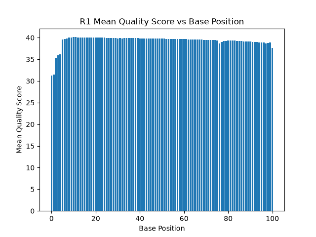
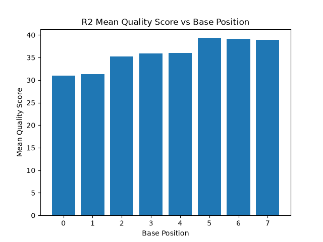
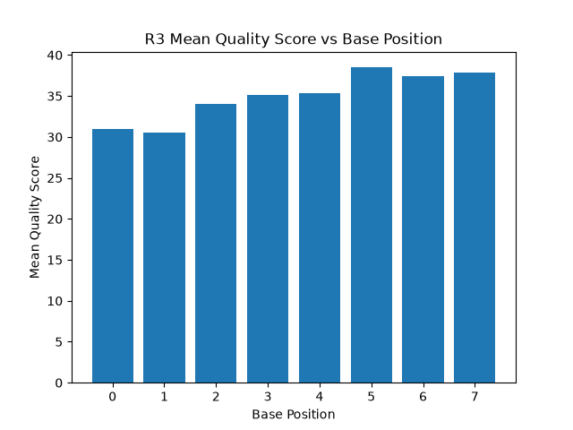
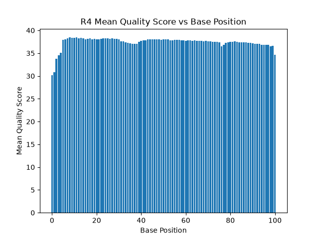

# Assignment the First

## Part 1
1. Be sure to upload your Python script. Provide a link to it here: [dataanalysis.py](dataanalysis.py)

| File name | label | Read length | Phred encoding |
|---|---|---|---|
| 1294_S1_L008_R1_001.fastq.gz | read1 | 101 | +33 |
| 1294_S1_L008_R2_001.fastq.gz | index1 | 8 | +33 |
| 1294_S1_L008_R3_001.fastq.gz | index2 | 8 | +33 |
| 1294_S1_L008_R4_001.fastq.gz | read2 | 101 | +33 |

2. Per-base NT distribution
    1. Use markdown to insert your 4 histograms here.
    
    
    
    

    2. For an individual base in indices, 25. All base positions in the index have qscores >30, so 25 should provide a sufficient buffer. Indices are also cross checked with their reverse complement and against the index values, so any misreads would have to fail multiple failsafes and have incorrect barcodes in order to cause analysis problems. 
    A cutoff of 30 should be suitable for whole biological reads for downstream analysis, since almost all positions have an average qscore >35. This is considered a high cutoff for sequencing analysis, but should be viable in this case due to the overall high average qscores
    3. ```/usr/bin/time -v zcat /projects/bgmp/shared/2017_sequencing/1294_S1_L008_R[2-3]_001.fastq.gz | grep "^+" -B 1 | grep -v "^+\n" | grep [N] | wc -l```
    7304664 indices with "N"

    
## Part 2
1. Define the problem
       Determine if index pairs are correct, incorrect, or are of low quality. Create fastq files for each correct index pair combination or write out to files for incorrect pairings or for barcodes with low quality. Calculate the number of sequences with each correct index pairing, with any hopping, or with unknown/low quality indices.
2. Output should be output files (24 fwd by barcode, 24 rev by barcode, 2 index hopped, 2 for unknown barcodes), counts of each
3. Upload your [4 input FASTQ files](../TEST-input_FASTQ) and your [>=6 expected output FASTQ files](../TEST-output_FASTQ).
4. Pseudocode
5. High level functions. For each function, be sure to include:
    1. Description/doc string
    2. Function headers (name and parameters)
    3. Test examples for individual functions
    4. Return statement
