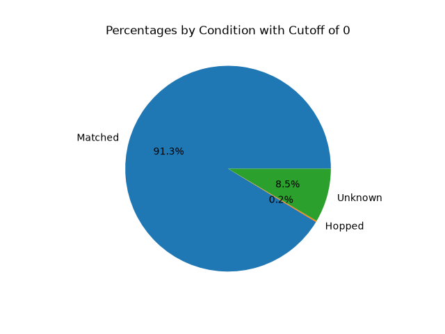
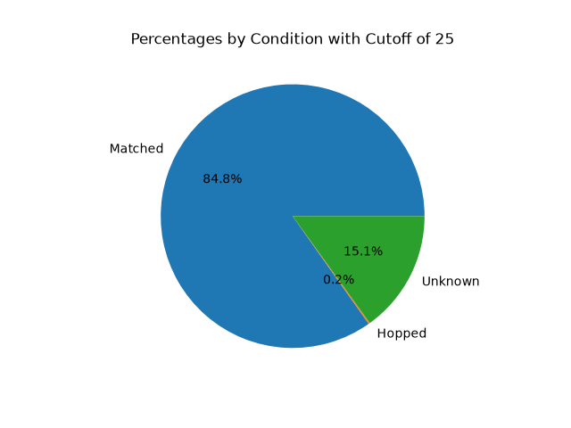
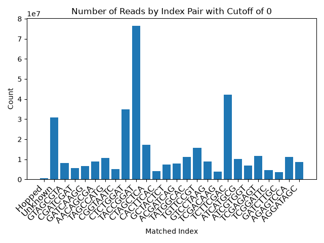
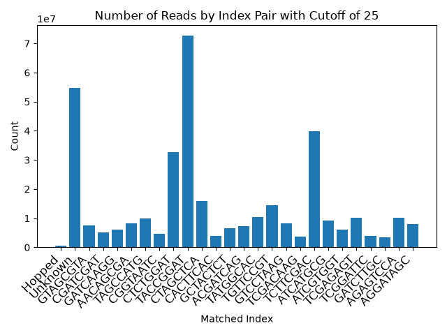
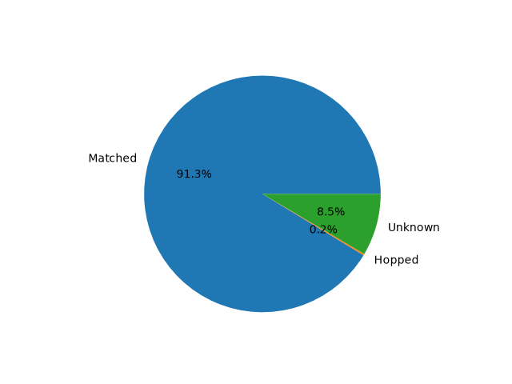
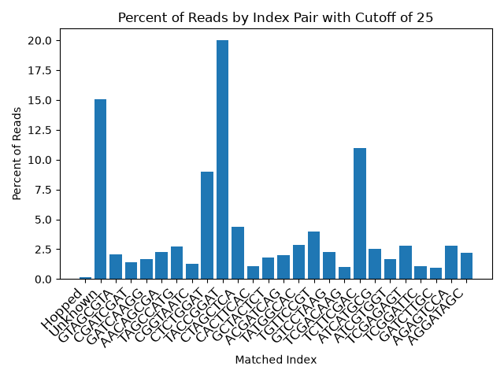

| Qscore cutoff | Matched Reads Count | % Matched Reads | Unknown Reads Count | % Unknown Reads | Hopped Reads Count | % Hopped Reads | Total Reads |
| --- | --- | --- | --- | --- | --- | --- | --- |
| 0 | 331755033 | 91.3 | 30783962 | 8.5 | 707740 | 0.2 | 363246735 |
| 25 | 307993310 | 84.8 |	54692531 | 15.1 | 560894 | 0.2 | 363246735 |

See Output_stats folder for all figures and detailed output statistics
See Demultiplex_stats...tsv files for individual index pair statistics

